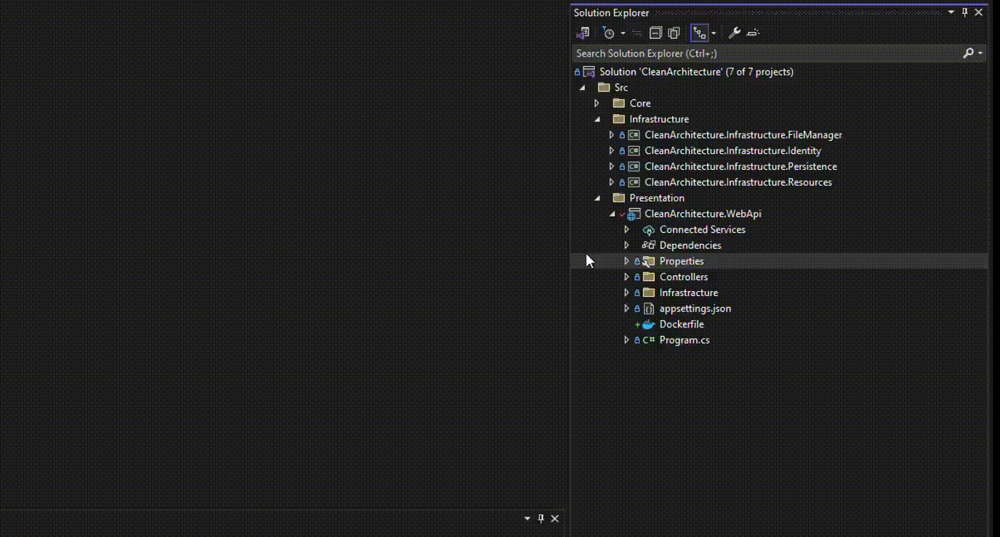

# [ASP Dotnet Core Clean Architecture](../README.md) - Deploy with docker

## Introduction

In the complex and dynamic world of software development, creating and managing software projects is one of the fundamental challenges for developers. However, with the emergence of new tools and technological innovations, new methods have been developed to facilitate this process. Docker, as one of these essential tools, improves the ability to create, manage, and deploy applications in different environments.

In this article, we delve into using Docker to deploy the CleanArchitecture project using .NET Core. This project serves as a simple example of a well-structured Clean Architecture for developing .NET Core applications

By reading and following this article, you'll be able to deploy your CleanArchitecture project quickly and with high portability using Docker. You'll experience valuable benefits in developing and managing your applications.

## Creating Dockerfile using Visual Studio

1. Open Your Project in Visual Studio
    - Open your CleanArchitecture project in Visual Studio.

2. Add Docker Support
    - If you haven't already, add Docker support to your project. To do this, right-click on your project in the Solution Explorer, select "Add" > "Docker Support".

3. Select Docker File Type
    - When prompted, choose the type of Docker file you want to add. You can select options like Linux or Windows container, depending on your requirements. For a .NET Core project, it's common to choose Linux.

4. Configure Dockerfile
    - Once Docker support is added, Visual Studio will create a Dockerfile for you in your project. Open this Dockerfile to customize it according to your project's requirements.

[](#)


## Running the Project

To run a Docker Compose project that utilizes volumes, follow these steps:

1. Open Command Prompt
    - First, open a Command Prompt in the directory containing the [docker-compose.yml](./../Deploy/docker-compose.yml) file.

2. Create Docker Volume
    - Run the following command to create the Docker volume
        ``` lua
        docker volume create --name=sqlserver_data
        ```
        This command creates a Docker volume named sqlserver_data.

3. Customize the project configuration
    - You can easily change the ports
    - You can change the SQL password in the `.env` file
    - And more 😂

4. Execute the `up` Command
    - Using the `docker-compose up -d` command, run the Docker Compose project. This command reads the Docker Compose file and creates the services specified within `docker-compose.yml`.
        ``` sh
        docker-compose up -d
        ```
        This command reads all the configurations and creates the corresponding containers while granting access to the volumes.

By following these steps, your Docker Compose project is created using volumes and is ready for use. You can now utilize this feature for managing data and information in your project effectively.


