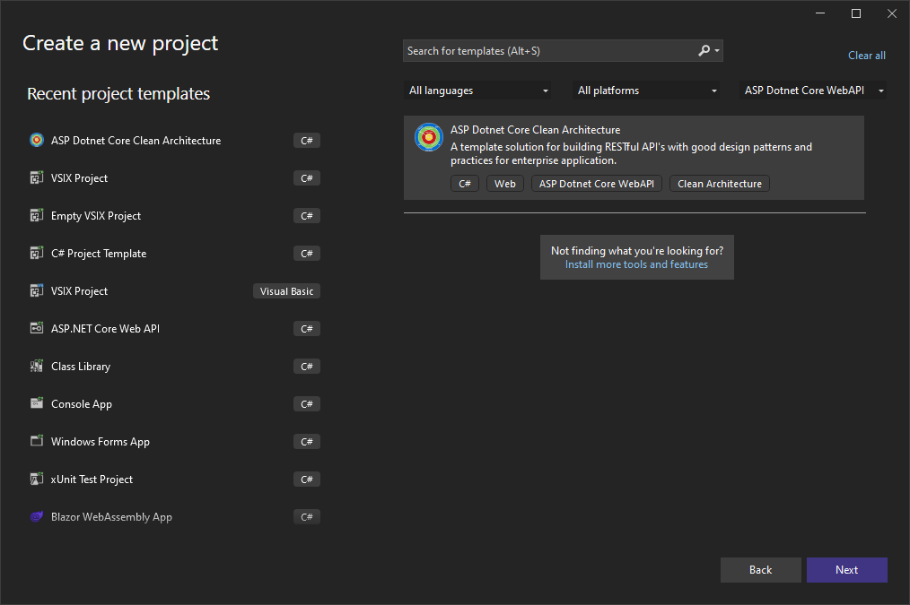
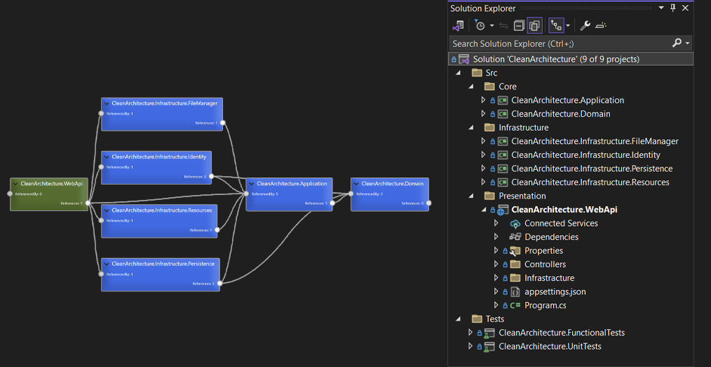
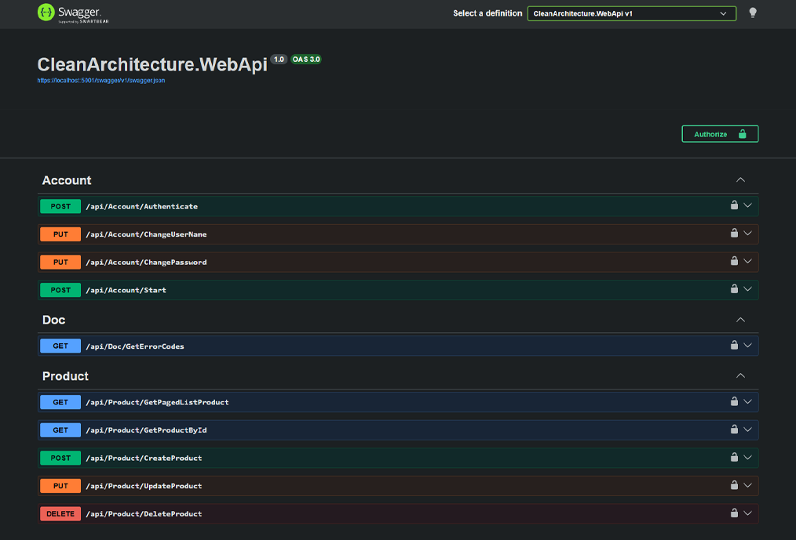

# ASP Dotnet Core Clean Architecture

[](https://www.nuget.org/packages/Sam.CleanArchitecture.Template)
[](https://marketplace.visualstudio.com/items?itemName=SamanAzadi1996.ASPDotnetCoreCleanArchitecture)

[](https://github.com/samanazadi1996/Sam.CleanArchitecture/actions)
[](https://github.com/samanazadi1996/Sam.CleanArchitecture/actions)
[](https://github.com/samanazadi1996/Sam.CleanArchitecture/actions)

The purpose of this template is to provide a robust and streamlined methodology for enterprise application development. By capitalizing on the strengths of Clean Architecture and ASP.NET Core, it ensures a maintainable, scalable, and efficient development process. This approach not only simplifies the complexity of enterprise systems but also enhances their performance and longevity.

# Getting Started with Dotnet cli

The following prerequisites are required to build and run the solution:

- [.NET 8.0 SDK](https://dotnet.microsoft.com/download/dotnet/8.0) (latest version)

The easiest way to get started is to install the [.NET template](https://www.nuget.org/packages/Sam.CleanArchitecture.Template):
```
dotnet new install Sam.CleanArchitecture.Template
```

You should see the template in the list of templates from dotnet new list after this installs successfully. Look for "ASP.NET Clean Architecture Solution" with Short Name of "ca-api".

Navigate to the parent directory in which you'd like the solution's folder to be created.

Run this command to create the CleanArchitecture project
##### "-n MyProjectName" can be our desired name for the project

``` sh
dotnet new ca-api -n MyProjectName
```

The MyProjectName directory and solution file will be created, and inside that will be all of your new solution contents, properly namespaced and ready to run/test!

### To increase the speed of coding, you can use the commands added in this package
1. [Create new UseCase](./Documents/CleanArchitectureTemplates.md#create-new-usecase)
2. [Create New Entity](./Documents/CleanArchitectureTemplates.md#create-new-entity)
3. [Create New Resource](./Documents/CleanArchitectureTemplates.md#create-new-resource)
4. [Easy Add Migration Tools ](./Documents/EasyAddMigrationTools.md)
5. [Configure Database ](./Documents/ConfigureDatabase.md)

# Getting Started with Visual Studio

[Download the Extension](https://marketplace.visualstudio.com/items?itemName=SamanAzadi1996.ASPDotnetCoreCleanArchitecture) and install it on your machine. Make sure Visual Studio 2022 is installed on your machine with the latest SDK.

Follow these Steps to get started.

[](#)

You Solution Template is Ready!

[](#)

Next, open the appsettings.json file in WebAPI to modify the ConnectionStrings if necessary.

Finally, build and run the Application.

# Default Roles & Credentials

As soon you build and run your application, default users and roles get added to the database.

Default Roles are as follows.
- Admin

Here are the credentials for the default users.
- UserName - Admin / Password - Sam@12345


You can use these default credentials to generate valid JWTokens at the ../api/v1/Account/Authenticate endpoint.

[](#)

# Purpose of this Project
Does it really make sense to Setup your ASP.NET Core Solution everytime you start a new WebApi Project ? Aren't we wasting quite a lot of time in doing this over and over gain?

This is the exact Problem that I intend to solve with this Full-Fledged ASP.NET Core 8 WebApi Solution Template, that also follows various principles of Clean Architecture.

The primary goal is to create a Full-Fledged implementation, that is well documented along with the steps taken to build this Solution from Scratch. This Solution Template will also be available within Visual Studio 2022 (by installing the required Nuget Package / Extension).

Demonstrate Clean Monolith Architecture in ASP.NET Core 8
- This is not a Proof of Concept
- Implementation that is ready for Production
- Integrate the most essential libraries and packages

## Frequently Asked Questions (FAQ)

To see the frequently asked questions and find answers related to using and developing the project, please refer to the FAQ file. This file includes common questions you might encounter while working with the project and provides links to the relevant documentation.

[Read the FAQ](./Documents/FAQ.md)


# Give a Star ⭐️

If you found this Implementation helpful or used it in your Projects, do give it a star. Thanks!

# Technologies

- ASP.NET Core 8 WebApi
- REST Standards

# Features

- [Clean Architecture](./Documents/CleanArchitecture.md)
- CQRS with MediatR Library
- Entity Framework Core - Code First
- [Repository Pattern - Generic](./Documents/RepositoryPatternGeneric.md)
- Serilog
- Swagger UI
- [Response Wrappers](./Documents/ResponseWrappers.md)
- [Healthchecks](./Documents/Healthchecks.md)
- Pagination
- Microsoft Identity with JWT Authentication
- Role based Authorization
- [Identity Seeding](./Documents/IdentitySeeding.md)
- [Database Seeding](./Documents/DatabaseSeeding.md)
- [Custom Exception Handling Middlewares](./Documents/ExceptionHandlingMiddlewares.md)
- API Versioning
- [Localization (fa / en)](./Documents/Localization.md)
- Fluent Validation
- Complete User Management Module (Register / Authenticate / Change UserName / Change Password)
- [User Auditing](./Documents/UserAuditing.md)
- TestProjects
    - [FunctionalTests](./Documents/FunctionalTests.md)
    - [UnitTests](./Documents/UnitTests.md)
    - [IntegrationTests](./Documents/IntegrationTests.md)

# Prerequisites

- Visual Studio 2022 Community and above
- .NET Core 8 SDK and above
- Basic Understanding of Architectures and Clean Code Principles

# Share it!

I have personally not come across a clean implementation on a WebAPI, which is the reason that I started building this up. There are quite a lot of improvements and fixes along the way from the day I started out. Thanks to the community for the support and suggestions. Please share this Repository within your developer community, if you think that this would a difference! Thanks.

# About the Author

### Saman Azadi
- Twitter - [Saman Azadi](https://twitter.com/intent/follow?screen_name=saman_azadi_)
- Linkedin - [Saman Azadi](https://www.linkedin.com/in/saman-azadi/)
- Github - [Saman Azadi](https://github.com/samanazadi1996)
